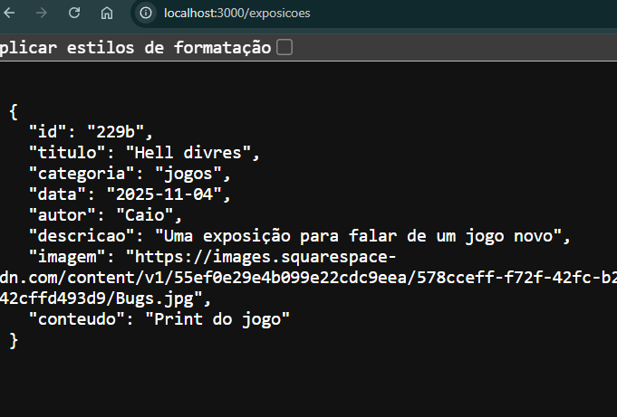
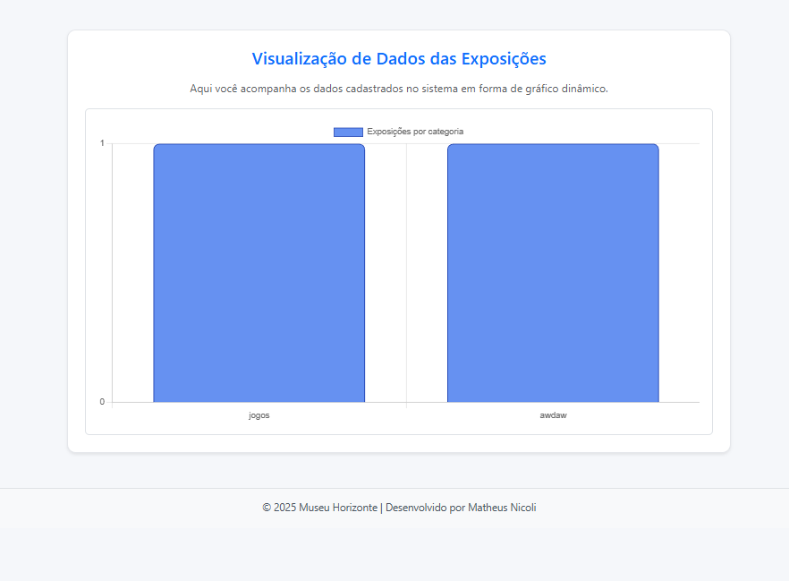

Trabalho Prático 07 - Semanas 13 e 14

Nesta etapa foi criada uma página de visualização dinâmica para mostrar os dados cadastrados no CRUD de forma gráfica.
Usei a biblioteca Chart.js para gerar um gráfico de barras que exibe a quantidade de exposições por categoria.
O gráfico atualiza automaticamente conforme os dados do JSON Server mudam.

Informações do trabalho

Nome: Matheus Nicoli

Matrícula: 885645

Proposta de projeto escolhida: Sistema de exposições de um museu

Breve descrição:
O projeto permite cadastrar, editar e excluir exposições, além de ver detalhes de cada uma. Nesta etapa foi adicionada uma tela de gráfico para visualizar os dados.

Print da tela com a implementação
Explicação da implementação

Foi criada a página visualizacao.html, onde o gráfico é montado a partir da API local (/exposicoes).
O arquivo visualizacao.js lê os dados do servidor, conta quantas exposições existem por categoria e exibe o resultado no gráfico.
Também foram feitos dois testes com dados diferentes para mostrar o funcionamento dinâmico.

Tela 1 — Gráfico com dados iniciais

Tela 2 — Gráfico atualizado após CRUD

